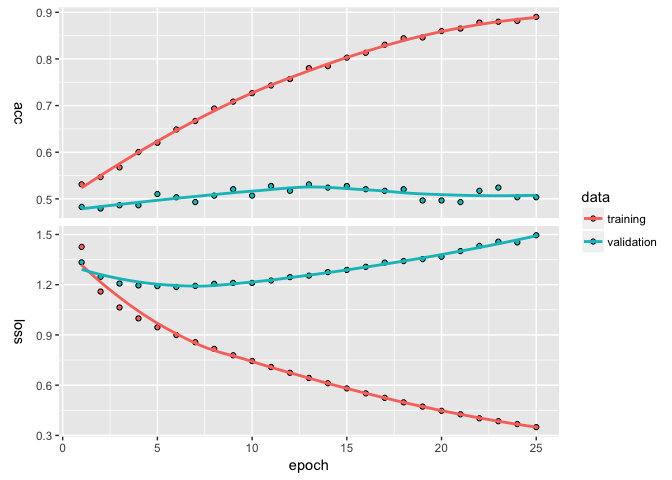

kms: foRmulas foR keRas
================
Pete Mohanty
January 04, 2018

The goal of this document is to introduce `kms`, the main function of `library(formulakeras)`, a high-level interface for [Keras for R](https://keras.rstudio.com/). `kms`, as in `keras_model_sequential()`, is a regression-style function that lets you build `keras` neural nets with `R` `formula` objects. Formulas are very powerful in R; in the first example below, a small tweak in the way the dependent variable is coded explains an additional 20% of out of sample variance. `kms` splits training and test data into sparse matrices.`kms` also auto-detects whether the dependent variable is categorical (see Example 1: rtweet) or binary (see Example 2: imdb).

`kms` accepts the major parameters found in `library(keras)` as inputs (loss function, batch size, number of epochs, etc.) and allows users to customize basic neural nets. Example 2 also shows how to pass a compiled `keras_model_sequential` to `kms` (preferable for more complex models). The examples here don't provide particularly predictive models so much as show how using `formula` objects can smooth data cleaning and hyperparameter selection.

To install the development version [formulakeras](https://github.com/rdrr1990/keras),

``` r
devtools::install_github("rdrr1990/kerasformula")
```

Example 1: rtweet data
======================

Let's start with an example using `rtweet` (from `@kearneymw`).

``` r
library(rtweet)
rt <- search_tweets("#rstats", n = 5000, include_rts = FALSE)
dim(rt)
```

    [1] 1842   42

``` r
summary(rt$retweet_count)
```

       Min. 1st Qu.  Median    Mean 3rd Qu.    Max. 
      0.000   0.000   0.000   3.903   3.000 179.000 

Suppose we wanted to predict how many times a tweet with `#rstat` is going to be retweeted. And suppose we wanted to bin the retweent count into five categories (none, 1-10, 11-50, 51-99, and 100 or more). Suppose we believe that the Twitter handle and source matters as does day of week and time of day.

``` r
library(kerasformula)
breaks <- c(-1, 0, 1, 10, 50, 100, 10000)
out <- kms("cut(retweet_count, breaks) ~ screen_name + source +
            grepl('gg', text) + grepl('tidy', text) + 
            grepl('rstudio', text, ignore.case = TRUE) +
            grepl('cran', text, ignore.case = TRUE) +
            grepl('trump', text, ignore.case = TRUE) +
            weekdays(rt$created_at) + 
            format(rt$created_at, '%d') + 
            format(rt$created_at, '%H')", data = rt)
plot(out$history)
```



``` r
summary(out$model)
```

    ___________________________________________________________________________
    Layer (type)                     Output Shape                  Param #     
    ===========================================================================
    dense_1 (Dense)                  (None, 128)                   114944      
    ___________________________________________________________________________
    dropout_1 (Dropout)              (None, 128)                   0           
    ___________________________________________________________________________
    dense_2 (Dense)                  (None, 6)                     774         
    ===========================================================================
    Total params: 115,718
    Trainable params: 115,718
    Non-trainable params: 0
    ___________________________________________________________________________

``` r
out$confusion
```

                 
                  (-1,0] (0,1] (1,10] (10,50] (50,100] (100,1e+04]
      (-1,0]         154    16     37       2        0           0
      (0,1]           26    11     18       0        0           0
      (1,10]          29     7     29      15        0           0
      (10,50]         12     2     10      24        0           0
      (50,100]         0     0      0       2        0           0
      (100,1e+04]      0     1      0       1        0           0

``` r
out$evaluations
```

    $loss
    [1] 1.336868

    $acc
    [1] 0.550505

Let's say we want to add some data about how many other people are mentioned in each tweet and switch to a (discretized) log scale.

``` r
rt$Nmentions <- unlist(lapply(rt$mentions_screen_name, 
                              function(x){length(x[[1]]) - is.na(x[[1]])}))

out2 <- kms("floor(log(retweet_count + 1)) ~ Nmentions + screen_name + source +
            grepl('gg', text) + grepl('tidy', text) + 
            grepl('rstudio', text, ignore.case = TRUE) +
            grepl('cran', text, ignore.case = TRUE) +
            grepl('trump', text, ignore.case = TRUE) +
            weekdays(rt$created_at) + 
            format(rt$created_at, '%d') + 
            format(rt$created_at, '%H')", 
            data = rt, Nepochs = 10)
out2$evaluations
```

    $loss
    [1] 0.7659704

    $acc
    [1] 0.7207447

``` r
out2$confusion
```

       
          0   1   2   3
      0 243  11   2   0
      1  53   8   2   0
      2  15   5  19   1
      3   8   3   4   1
      4   0   0   1   0

Heading in the right direction. Suppose instead we wanted to add who was mentioned.

``` r
input.formula <- "floor(log(retweet_count + 1)) ~ Nmentions + screen_name + source +
            grepl('gg', text) + grepl('tidy', text) + 
            grepl('rstudio', text, ignore.case = TRUE) + 
            grepl('cran', text, ignore.case = TRUE) +
            grepl('trump', text, ignore.case = TRUE) +
            weekdays(rt$created_at) + format(rt$created_at, '%d') + 
            format(rt$created_at, '%H')"

handles <- names(table(unlist(rt$mentions_screen_name)))

for(i in 1:length(handles)){
  lab <- paste0("mentions_", handles[i])
  rt[[lab]] <- grepl(handles[i], rt$mentions_screen_name)
  input.formula <- paste(input.formula, "+", lab)
}

out3 <- kms(input.formula, data = rt, Nepochs = 10, seed = 1)
out3$evaluations
```

    $loss
    [1] 0.8755431

    $acc
    [1] 0.7154255

``` r
out3$confusion
```

       
          0   1   2
      0 242  21   2
      1  36  13   5
      2  17   9  14
      3   5   3   5
      4   0   2   2

Marginal improvement but the model is still clearly overpredicting the modal outcome (zero retweets) and struggling to forecast the rare, popular tweets. Maybe the model needs more layers.

``` r
out4 <- kms(input.formula, data = rt, 
            layers = list(units = c(405, 135, 45, 15, NA), 
                         activation = c("softmax", "relu", "relu", "relu", "softmax"), 
                         dropout = c(0.7, 0.6, 0.5, 0.4, NA)),
            Nepochs = 6)
out4$evaluations
```

    $loss
    [1] 0.9109331

    $acc
    [1] 0.7107438

``` r
out4$confusion
```

       
          0
      0 258
      1  62
      2  26
      3  13
      4   3
      5   1

Suppose we wanted to see if the estimates were stable across 10 test/train splits.

``` r
est <- list()
accuracy <- c()
for(i in 1:10){
  est[[paste0("seed", i)]] <- kms(input.formula, rt, seed = i,
            layers = list(units = c(405, 135, 45, 15, NA), 
                         activation = c("softmax", "relu", "relu", "relu", "softmax"), 
                         dropout = c(0.7, 0.6, 0.5, 0.4, NA)),
            Nepochs = 10)
  accuracy[i] <- est[[paste0("seed", i)]][["evaluations"]][["acc"]]
}
accuracy
```

     [1] 0.7047872 0.6756757 0.6870027 0.6789773 0.6770026 0.7008086 0.6481481
     [8] 0.6639118 0.6397695 0.6583333

Hmmm... Maybe Model 3 is the closest ... Of course, we might just want more data.

Example 2: imdb
===============

This example works with some of the imdb data that comes with library(keras). Specifically, this example compares the default dense model that `ksm` generates to the `lstm` model described [here](https://keras.rstudio.com/articles/examples/imdb_lstm.html). To control runtime, the number of features are limited and only a sliver of the training data is used.

``` r
max_features <- 5000 # 5,000 words (ranked by popularity) found in movie reviews
maxlen <- 50  # Cut texts after 50 words (among top max_features most common words) 

cat('Loading data...\n')
```

    Loading data...

``` r
imdb <- dataset_imdb(num_words = max_features)
imdb_df <- as.data.frame(cbind(imdb$train$y, pad_sequences(imdb$train$x)))

demo_sample <- sample(nrow(imdb_df), 1000)
out_dense = kms("V1 ~ .", data = imdb_df[demo_sample, ], Nepochs = 2)
out_dense$confusion
```

       
          1
      0 105
      1 101

``` r
k <- keras_model_sequential()
k %>%
  layer_embedding(input_dim = max_features, output_dim = 128) %>% 
  layer_lstm(units = 64, dropout = 0.2, recurrent_dropout = 0.2) %>% 
  layer_dense(units = 1, activation = 'sigmoid')

k %>% compile(
  loss = 'binary_crossentropy',
  optimizer = 'adam',
  metrics = c('accuracy')
)

out_lstm = kms(input_formula = "V1 ~ .", data = imdb_df[demo_sample, ], keras_model_seq = k, Nepochs = 2)
out_lstm$confusion
```

       
          0   1
      0 100  17
      1  45  67

Clearly, `out_lstm` is more accurate (`out_dense` is a "broken clock").

Though `kms` contains a number of parameters, the goal is not to replace all the vast customizability that `keras` offers. Rather, like `qplot` in the `ggplot` library, `kms` offers convenience for common scenarios. Or, perhaps better, like `MCMCpack` or `rstan` do for Bayesian MCMC, `kms` aims to introduce users familiar with regression in R to neural nets without steep scripting stumbling blocks. Suggestions are more than welcome!
